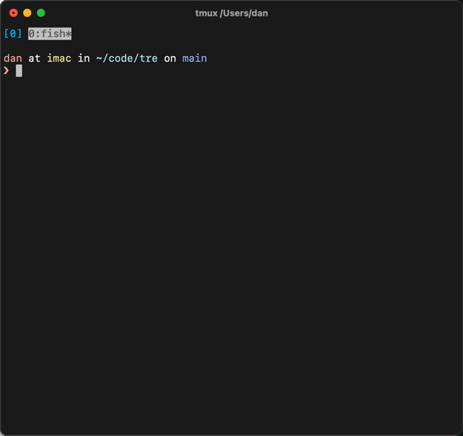

# tre

A modern alternative to the `tree` command that:

* lists directory structure in a tree-like diagram, like the classics.
* skips ignored files in git repositories per `.gitignore` setting.
* creates shell aliases for each listing that opens the files for you.
* output in colors, respecting [LS_COLORS][] settings when they exist.

Command aliasing demo:



… in case you missed it: `[8]` is shown in front of "README.md" and typing `e8`
opened the file! See [how to set this up](#editor-aliasing).

[LS_COLORS]: https://man7.org/linux/man-pages/man5/dir_colors.5.html

## Install

#### Via a package manager

Tre is available in the following package managers.

| Manager / OS                         | Command                      |
| ------------------------------------ | ---------------------------- |
| Homebrew / macOS                     | `brew install tre-command`   |
| Debian (unstable)                    | `apt install tre-command`    |
| Nix / NixOS                          | `nix-env -i tre-command`     |
| Scoop / Windows                      | `scoop install tre-command`  |
| Cargo                                | `cargo install tre-command`  |
| AUR / Arch Linux                     | `yay tre-command`            |
| pkgsrc (bleeding edge) / NetBSD 9.1+ | `pkgin install tre-command`  |

_The commands above are basic instructions. Use your favorite alternatives if
you have one. For example, use a config file for Nix; or other method to install
from AUR; pkgsrc can be use on OSes other than NetBSD etc._

### Pre-built executable

Choose an pre-built executable from the [release page][] that fits your
platform to download. Unpack it somewhere you'd like to run it from.

[release page]: https://github.com/dduan/tre/releases

### From Source

1. Clone this repository: `git clone https://github.com/dduan/tre.git`.
2. Ensure you have Rust and Cargo installed. If not, follow instruction [here](https://rustup.rs).
3. In the root level of this repo, run `cargo build --release`.
4. Move `target/release/tre` to somewhere in your PATH environment variable.

## Editor aliasing

tre provides a `-e` flag that, when used, turns on the "editor aliasing"
feature. Some shell configuration will make this work better.

### macOS/Linux
By default, the environment variable `$EDITOR` is used as the editor. If a
value following `-e` is supplied (`tre -e emacs` instead of `tre -e`), then
the command specified by this value will be used instead of `$EDITOR`. Update
the script in the next section accordingly.

#### Bash or Zsh

In `~/.bashrc` or `~/.zshrc` (for example)

```bash
tre() { command tre "$@" -e && source "/tmp/tre_aliases_$USER" 2>/dev/null; }
```

#### Fish

Create `~/.config/fish/functions/tre.fish`:

```fish
function tre
  command tre $argv -e; and source /tmp/tre_aliases_$USER ^/dev/null
end
```

### Windows (10+)

Instead of directly executing `tre.exe`, we'll set up a script that's
available in your `PATH` environment variable. For example, you can add
`\Users\yourname\bin` to your `PATH` environment variable, and created the
script there. When you use `tre`, this script executes `tre.exe`, and do some
additional work. The content of the script is different for PowerShell and
Command Prompt.

By default, the default program known by Windows will be used to open the
file. If a value following `-e` is supplied (`tre -e notepad.exe` instead of
`tre -e`), then the command specified by this value will be used. Update the
scripts in the next section accordingly.

#### PowerShell

Add a `tre.ps1` file:

```ps1
if (Get-Module PSReadLine) {
  Remove-Module -Force PSReadLine
}
tre.exe $args -e
. $Env:TEMP\tre_aliases_$env:USERNAME.ps1
```

#### Command Prompt (CMD.exe)

Add a `tre.bat`:

```
@echo off
tre.exe %* -e
call %TEMP%\tre_aliases_%USERNAME%.bat
```

### How it works

The first thing you'll notice is some numbers in front of each file name in
tre's output. If pick a number, say, "3", and enter `e3` in the shell, the file
after "3" will open in your default program (specified by the environment
variable `EDITOR` in macOS/Linux, and picked by Windows).

Everytime tre runs with `-e`, it updates a file in a temporary directory, and
adds an alias for each result it displays. And the additional configuration
simply sources this file after the command. You can manually run

in Bash/Zsh/Fish:
```bash
source /tmp/tre_aliases_$USER
```

or

in PowerShell
```ps1
. $Env:TEMP\tre_aliases_$env:USERNAME.ps1
```

or

in Command Prompt

```
call %TEMP%\tre_aliases_%USERNAME%.bat
```

… instead of configuring your system (if you are _that_ patient!).

## Everything else

Here's the output from `tre -h`, showing all available options provided by tre:

```
Usage: tre [path] [option]

Print files, directories, and symlinks in tree form.

Hidden files and those configured to be ignored by git will be (optionally)
ignored.

With correct configuration, each displayed file can have a shell alias created
for it, which opens the file in the default editor or an otherwise specified
command.

Path:
    The root path whose content is to be listed. Defaults to ".".

Options:
    -a, --all           Print all files and directories, including hidden
                        ones.
    -d, --directories   Only list directories in output.
    -e, --editor [EDITOR]
                        Create aliases for each displayed result in
                        /tmp/tre_aliases_$USER and add a number in front of
                        file name to indicate the alias name. For example, a
                        number "42" means an shell alias "e42" has been
                        created. Running "e42" will cause the associated file
                        or directory to be open with $EDITOR, or a command
                        specified along with this command.
    -j, --json          Output JSON instead of tree diagram.
    -l, --limit [DEPTH] Limit display depth file tree output.
    -s, --simple        Use normal print despite gitignore settings. '-a' has
                        higher priority.
    -v, --version       Show version number.
    -h, --help          Show this help message.

Project site: https://github.com/dduan/tre
```

## License

MIT. See `LICENSE.md`.
